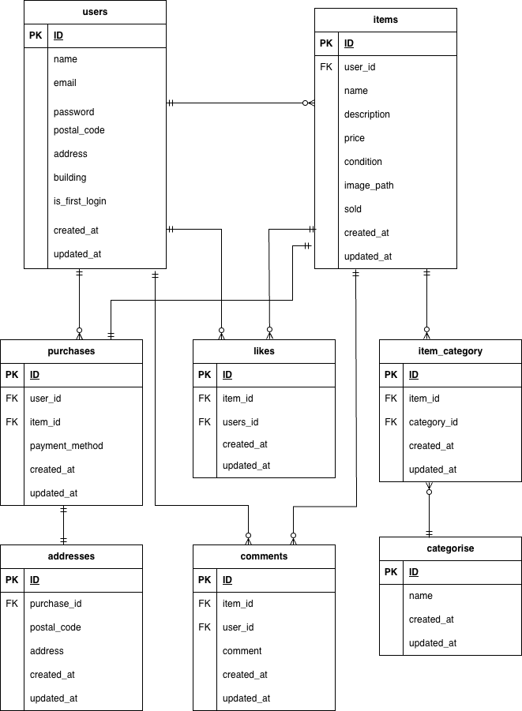

# Furima（フリマアプリ）

## Docker ビルド

```bash
git clone https://github.com/shiroyama373/furima.git
docker-compose build
docker-compose up -d
```

※注意: MySQL は OS によって起動しない場合があります。
 その場合は、docker-compose.yml を編集し、環境に合わせて調整してください。


## laravel環境構築

```bash
docker-compose exec php bash
cd /var/www
composer install
cp .env.example .env      # 環境変数を変更
php artisan key:generate
php artisan migrate:fresh --seed
php artisan storage:link
```
※ .env の DB 設定は docker-compose.yml に合わせてください
※ Stripe テスト用 API キーは .env に設定してください
※ Stripe 決済をテストする場合は、ローカルの .env にテスト用 API キーを設定してください
※	.env.example にはダミー値が入っています


## 開発環境

- 開発環境（アプリ）: http://localhost/
- phpMyAdmin: http://localhost:8080/
- Mailpit UI: http://localhost:8025/


## 使用技術
- PHP 8.3.28
- Laravel 10.49.1
- MySQL 8.0.33
- Nginx 1.21.1
- Docker 28.0.1
- Stripe (stripe/stripe-php ^19.0)

## ER図



## 注意事項
- Docker 環境によって MySQL が起動しない場合があります
- 既存のポートが重複しているとコンテナが起動できません- Stripe 決済はテスト用キーで動作確認可能です
- メール送信は Mailpit を通して確認できます（ユーザーには送信されません）
- コンビニ決済はテスト環境では、Webhookを動かすために Stripe Dashboard で ‘Mark as paid’ を押す必要があります


## ダミーデータについて

初期状態で以下のダミーデータが用意されています：

- ユーザー
  - 名前: テスト太郎
  - メール: test@example.com
  - パスワード: password

> ※パスワードはシーディング時にハッシュ化されています。  
> ログイン時は上記のパスワードを使用してください。
