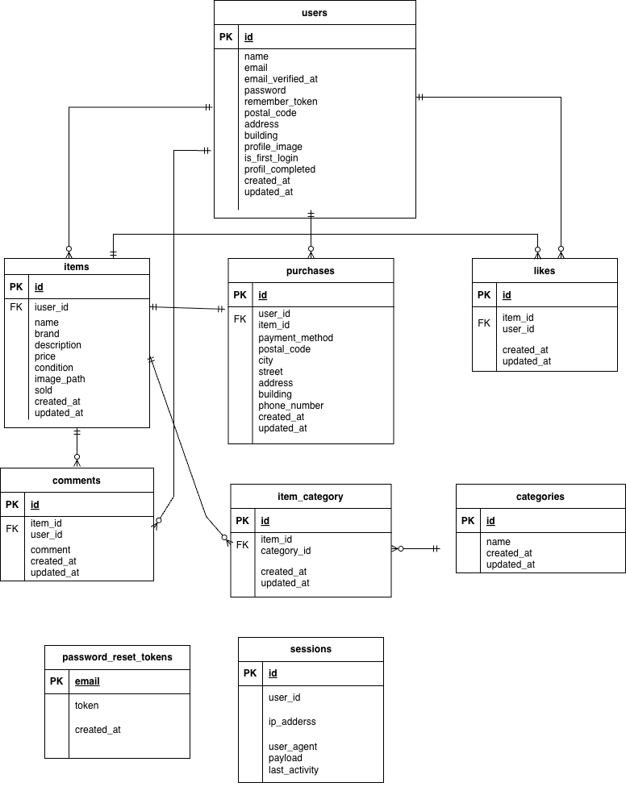

# Furima（フリマアプリ）

## 目次
- [環境構築](#環境構築)
- [使用技術](#使用技術)
- [テスト](#テスト)
- [ER図](#er図)
- [注意事項](#注意事項)

## 環境構築

### Docker ビルド
```bash
git clone https://github.com/shiroyama373/furima.git
cd furima
docker-compose build
docker-compose up -d
```

※注意: MySQL は OS によって起動しない場合があります。
その場合は、docker-compose.yml を編集し、環境に合わせて調整してください。

### Laravel環境構築
```bash
docker-compose exec php bash
composer install
cp .env.example .env      # 環境変数を変更
php artisan key:generate
php artisan migrate:fresh --seed
php artisan storage:link
```

**環境設定の注意点:**
- .env の DB 設定は docker-compose.yml に合わせてください
- Stripe テスト用 API キーは .env に設定してください
- .env.example にはダミー値が入っています

### 開発環境

- アプリケーション: http://localhost/
- phpMyAdmin: http://localhost:8080/
- Mailpit UI: http://localhost:8025/

## 使用技術

- PHP 8.3.28
- Laravel 10.49.1
- MySQL 8.0.33
- Nginx 1.21.1
- Docker 28.0.1
- Stripe (stripe/stripe-php ^19.0)
- PHPUnit 10.x (テストフレームワーク)

## テスト

### テストの実行
```bash
# 全テストを実行
php artisan test

# 特定のテストのみ実行
php artisan test --filter RegisterTest
php artisan test --filter LoginTest
```

### テストカバレッジ

**合計: 34テスト (69アサーション)**

#### 実装済みテスト一覧

| テストファイル | テスト数 | 内容 |
|--------------|---------|------|
| RegisterTest | 6 | 会員登録機能（バリデーション、登録処理） |
| LoginTest | 4 | ログイン機能（バリデーション、認証） |
| LogoutTest | 1 | ログアウト機能 |
| ItemListTest | 3 | 商品一覧取得（全商品表示、Soldラベル、自分の商品非表示） |
| MyListTest | 3 | マイリスト一覧（いいねした商品、Soldラベル、未認証時） |
| ItemSearchTest | 2 | 商品検索（部分一致検索、検索キーワード保持） |
| LikeTest | 2 | いいね機能（いいね登録、いいね解除） |
| CommentTest | 4 | コメント送信（認証済み投稿、未認証拒否、バリデーション） |
| PurchaseTest | 2 | 商品購入（購入画面表示、購入履歴追加） |
| SellTest | 2 | 商品出品（出品画面表示、商品登録） |
| UserProfileTest | 4 | ユーザー情報（情報表示、出品商品一覧、購入商品一覧、プロフィール編集） |
| ExampleTest | 1 | ユニットテスト（サンプル） |

### テスト環境設定

テストは SQLite インメモリデータベースを使用します。`phpunit.xml` に以下の設定があります：
```xml
<php>
    <env name="APP_ENV" value="testing"/>
    <env name="DB_CONNECTION" value="sqlite"/>
    <env name="DB_DATABASE" value=":memory:"/>
</php>
```

## ER図



## ダミーデータについて

初期状態で以下のダミーデータが用意されています：

### ユーザー情報
- 名前: テスト太郎
- メール: test@example.com
- パスワード: password

> ※パスワードはシーディング時にハッシュ化されています。  
> ログイン時は上記のパスワードを使用してください。

## 注意事項

### 環境
- Docker 環境によって MySQL が起動しない場合があります
- 既存のポートが重複しているとコンテナが起動できません

### Stripe決済
- Stripe 決済はテスト用キーで動作確認可能です
- コンビニ決済のテスト環境では、Webhookを動かすために Stripe Dashboard で 'Mark as paid' を押す必要があります

### メール
- メール送信は Mailpit を通して確認できます（実際のユーザーには送信されません）
- メール確認: http://localhost:8025/

## トラブルシューティング

### テストが失敗する場合
```bash
# キャッシュをクリア
php artisan config:clear
php artisan cache:clear

# マイグレーションをリセット
php artisan migrate:fresh --seed --env=testing
```

### Docker コンテナが起動しない場合
```bash
# コンテナを停止して再起動
docker-compose down
docker-compose up -d

# ログを確認
docker-compose logs
```